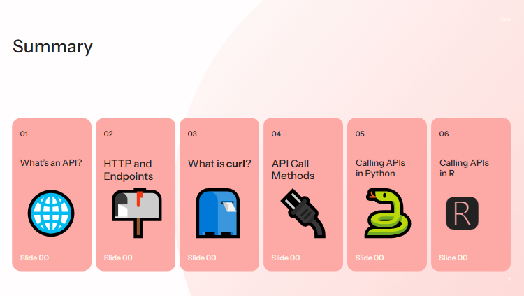

# README `/query_api`

## Getting Started: Your First API Calls

This folder contains simple examples to help you make your first API calls using:

- `curl` in Git Bash
- Python
- R

You may consult [**this Google Slides presentation for a introduction to making API calls**](https://docs.google.com/presentation/d/1BYC2KujLtMvbIBffU0aUg-vlMYpa__XOj_9Z13XBpUg/edit?usp=sharing).



## Prerequisites: Install the Tools

Before running the examples, make sure you have the following installed:

### 1. Git & Git Bash
- **Download:** [https://git-scm.com/downloads](https://git-scm.com/downloads)
- Git Bash is included with the standard Git for Windows installer. After installation, you can open "Git Bash" from your Start menu.

### 2. curl
- **Windows:** curl is included by default in recent versions of Windows 10/11. You can also use the version bundled with Git Bash.
- **macOS/Linux:** curl is usually pre-installed. If not, install via your package manager (e.g., `brew install curl` or `sudo apt install curl`).
- **More info:** [https://curl.se/download.html](https://curl.se/download.html)

### 3. Python
- **Download:** [https://www.python.org/downloads/](https://www.python.org/downloads/)
- Make sure to check "Add Python to PATH" during installation.
- Make sure to update the `PATH` for Python in this repository's [`.bashrc` file](https://github.com/timothyfraser/foundations/tree/main/.bashrc), and then run `source .bashrc` to load them for your session.

### 4. R
- **Download:** [https://cran.r-project.org/mirrors.html](https://cran.r-project.org/mirrors.html)
- Make sure to update the `PATH` and `R_LIBS_USER` for R in this repository's [`.bashrc` file](https://github.com/timothyfraser/foundations/tree/main/.bashrc), and then run `source .bashrc` to load them for your session.

---

## Example 1: Using curl in Git Bash

See [`01_example_curl.sh`](01_example_curl.sh) for example API calls using `curl`.

To run an example, open Git Bash and enter:
```bash
bash 01_example_curl.sh
```
Or copy-paste individual `curl` commands from the script into your Git Bash window.

---

## Example 2: Using Python

See [`02_example_python.py`](02_example_python.py) for a simple Python script using the `requests` library.

To run:
1. Install the `requests` library if you haven't:
```bash
pip install requests
```
2. Run the script:
```bash
python 02_example_python.py
```

---

## Example 3: Using R

See [`02_example_r.R`](02_example_r.R) for an R script using the `httr2` and `jsonlite` packages.

To run:
1. Install the required packages (in R):
```R
install.packages(c("httr2", "jsonlite"))
```
2. Run the script in RStudio or from the R console:
```R
source("02_example_r.R")
```
or run it from Git Bash as:
```bash
R -q -e "source('02_example_r.R')"
```


---

## More Information
- [What is an API? (MDN)](https://developer.mozilla.org/en-US/docs/Learn/JavaScript/Client-side_web_APIs/Introduction)
- [curl Documentation](https://curl.se/docs/)
- [Python requests Documentation](https://docs.python-requests.org/en/latest/)
- [R httr2 Documentation](https://httr2.r-lib.org/)
